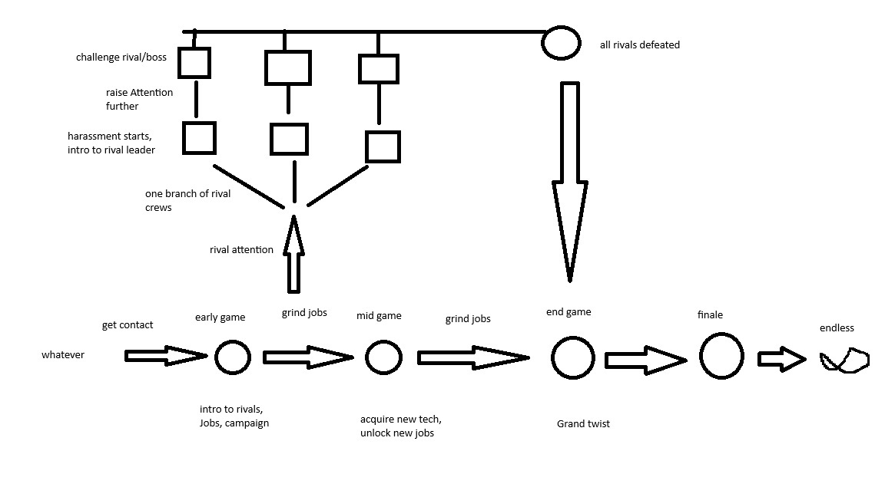

# Roadmap

## Description
Racing Sector is a lightweight campaign mod, aiming to improve the already existing gameplay loop.
The player will have access to new jobs themed about racing for the established setting in the game.
A major story element for RacingSector is the implementation of Rivals / rival crews in a similar fashion to the Need for Speed games: Carbon , Pro Street.

## Contents

### Refits
- new visual customizations
- a new way to tune the controls of ships

### Hulls
- new variants of vanilla ships: straight upgrades over the regular version, deployed by rival gangs to gain an edge in the scene.
- unique ships owned by rival bosses, which can be earned

### abilities
- the player will get access to new abilities which will be useful in campaign jobs and exploration / travel

### Contacts
- independent and pirate Contacts will offer new racing related jobs 
- a special contact that will guarantee racing jobs and is related to the campaign

### Space bar
- new bar events
- improving the feel
- opportunity to gain new officers

## Campaign flow

when certain conditions are met, the player will have the opportunity to meet the special contact.
The special Contact will then perform an exposition and start offering racing related jobs. This marks the beginning of the early game.
As the player completes jobs and progresses through the campaign, the player will attract the attention of rival crews. The rival crews are specialized in certain racing jobs and completing them will raise their attention.
Once the attention has progressed far enough, the rival crews will start harassing the player, serving as an obstacle to the player.
When the attention reached its maximum, the player will have the opportunity to challenge the leader of the rival crew. The rivals serve as wall which has to be overcome by the player to enter the endgame.

## Rivals

As a racing oriented mod, revolving around speed, capital ships will be excluded as they do not fit in with the theme.
Each rival crew will have its own (theme / design) and occupy a certain racing (***market*** / category) in a similar fashion to NFS carbons crews and NFS pro streets teams.
